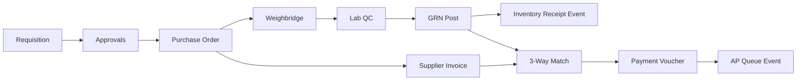

# Supplier Management & Procurement Module

Production-ready procurement for a **maize milling ERP**, integrated with existing Prisma/MySQL, Express, and React (Vite) stack.

## Recommendation: Prisma + MySQL

| Choice | Rationale |
|--------|-----------|
| **Prisma on MySQL** | Already used; strict FKs, enums, migrations, audit-friendly |
| Not Mongoose | No document store in this codebase |
| Not split schemas | Single `schema.prisma` keeps cross-module joins (inventory, traceability) |

---

## 1. Database schema

**Location:** `backend/prisma/schema.prisma`

### Extended models

- **Supplier** — CRM fields (PIN/VAT, bank), `SupplierOnboardingStatus` workflow
- **SupplierComplianceDocument** — digital wallet with `ACTIVE | EXPIRING_SOON | NON_COMPLIANT`
- **ProcurementItemProfile** — category-specific catalog (raw maize, bag sizes, consumables, spares)
- **PurchaseRequisition** / **PurchaseRequisitionLine**
- **ApprovalThreshold** — monetary routing (Head Procurement vs Finance Director)
- **ProcurementApproval** — approval audit trail
- **PurchaseOrder** / **PurchaseOrderLine** — multi-currency, tax, split receipts via `quantityReceived`
- **WeighbridgeTicket** — gross/tare/net, links PO + `RawMaizeBatch`
- **ProcurementQCLabResult** — maize + packaging metrics, grading, deductions, `blocksInventoryPost`
- **GoodsReceivedNote** / **GoodsReceivedNoteLine** — split delivery (`deliverySequence`), lot/batch trace
- **SupplierInvoice**, **ThreeWayMatch**, **PaymentVoucher**
- **DomainEvent** — outbox for inventory/finance hooks
- **ProcurementAuditLog** — entity-level audit

### Indexes (batch & traceability)

- `GoodsReceivedNote`: `lotNumber`, `batchTraceCode`, `grnNumber`
- `RawMaizeBatch`: existing `batchNumber`, `supplierId`, `expiryDate`
- `DomainEvent`: `(status, createdAt)`, `(aggregateType, aggregateId)`

### Apply migration

```bash
cd backend
npx prisma migrate dev --name procurement_module
npx prisma generate
```

---

## 2. REST API (`/api/suppliers`, `/api/procurement`, `/api/traceability`)

### Supplier CRM (`/api/suppliers`)

| Method | Path | Description |
|--------|------|-------------|
| GET | `/` | List suppliers (`?activeOnly=true`) |
| GET | `/:id` | Profile + compliance documents |
| GET | `/:id/performance` | QC approval rate, avg moisture/aflatoxin |
| POST | `/` | Create supplier (CRM fields) |
| PATCH | `/:id` | Update profile |
| POST | `/:id/documents` | Add compliance doc (auto status from expiry) |
| POST | `/:id/onboarding/advance` | Draft → QA → Finance → Active |

### Procurement lifecycle (`/api/procurement`)

| Method | Path | Validation highlights |
|--------|------|------------------------|
| GET/POST | `/item-profiles` | Category enum, optional low-stock thresholds |
| GET/POST | `/requisitions` | Min 1 line, positive qty |
| POST | `/requisitions/low-stock/generate` | Scans profiles vs `InventoryItem.quantity` |
| POST | `/requisitions/:id/submit` | DRAFT only |
| POST | `/requisitions/:id/approve` | Level: `HEAD_PROCUREMENT` \| `FINANCE_DIRECTOR` |
| GET | `/purchase-orders` | Filter `?status=` |
| POST | `/purchase-orders/from-requisition/:id` | Requires APPROVED + supplierId |
| POST | `/purchase-orders/:id/issue` | Emits `PO_ISSUED` event |
| POST | `/weighbridge/tickets` | `net = gross - tare` > 0 |
| POST | `/qc/maize` | Moisture, aflatoxin, insects, FM%, rotten% |
| POST | `/qc/packaging` | Tensile, alignment, dimensions |
| GET/POST | `/grns` | Split delivery lines |
| POST | `/grns/:id/post` | Blocked if QC `blocksInventoryPost` |
| POST | `/supplier-invoices` | Unique per supplier+invoiceNumber |
| POST | `/three-way-match` | Default 1% tolerance |
| POST | `/three-way-match/:id/approve-payment` | Creates payment voucher |
| POST | `/payment-vouchers/:id/push-ap` | AP queue event |
| GET | `/events/pending` | Outbox poll for workers |

### Traceability (existing, now mounted)

`POST /api/traceability/receive-raw-maize` — links `supplierId`, weighbridge weights, quarantine until legacy QC.

---

## 3. Domain logic

### Maize QC grading (`helpers.evaluateMaizeQC`)

- **Full rejection:** aflatoxin ≥ limit, live insects, critical moisture/FM
- **Conditional:** moisture/rotten/FM deductions → `priceDeductionPct`, grade B/C
- **Passed:** grade A, inventory posting allowed

### 3-way match

```
priceVariance% = |invoice - PO| / PO × 100
quantityVariance% = |invoice - GRN| / GRN × 100
```

If either > `tolerancePct` (default 1%) → discrepancy status; else `MATCHED`.

### Events (Kafka/EventBridge style)

**Publisher:** `backend/src/events/eventBus.ts` — persists `DomainEvent`, emits in-process.

| Event | Consumers (hooks) |
|-------|-------------------|
| `procurement.grn.posted` | Inventory valuation |
| `procurement.inventory.receipt` | Stock ledger |
| `procurement.finance.ap_queue_push` | Accounts Payable |
| `procurement.qc.completed` | Alerts, supplier scorecard |

Register listeners in `procurementListeners.ts`; external workers poll `GET /api/procurement/events/pending`.

---

## 4. Frontend structure

```
frontend/src/
├── modules/procurement/
│   ├── types/procurement.ts      # Shared TS types
│   ├── api/procurementClient.ts  # fetch wrappers
│   └── components/StatusBadge.tsx
└── pages/procurement/
    ├── ProcurementDashboard.tsx  # KPIs + nav
    ├── Suppliers.tsx             # CRM table, onboarding badges
    ├── Requisitions.tsx          # Pending row highlight
    ├── PurchaseOrders.tsx        # OVERDUE delivery styling
    ├── ReceivingQC.tsx           # QC fail = red row
    └── ThreeWayMatch.tsx         # Finance workspace
```

**Routes:** `/procurement`, `/procurement/suppliers`, `/procurement/suppliers/:id`, `.../requisitions`, `.../purchase-orders`, `.../receiving`, `.../finance`

**Layout:** Procurement uses a dedicated `ProcurementLayout` sidebar (not the main ERP inventory/production nav). Use **Back to all modules** to return to `/app`.

**State management (recommended next step):**

- React Query for server cache (`requisitions`, `grns`, `purchaseOrders`)
- Context or Zustand for active PO/GRN wizard (weighbridge → QC → post)
- Optimistic updates only on draft requisitions

**Conditional UI:**

| Condition | Style |
|-----------|--------|
| `FULL_REJECTION`, `NON_COMPLIANT` | `bg-red-50` |
| `PENDING_QC`, `EXPIRING_SOON`, `PENDING_FINANCE` | `bg-amber-50` |
| PO past `expectedDelivery` + `ISSUED` | `OVERDUE` label |
| 3-way `*_DISCREPANCY` | orange/red badges |

---

## 5. End-to-end flow



---

## 6. SOLID layout (backend)

| Layer | Responsibility |
|-------|----------------|
| `routes/*.ts` | HTTP + Zod validation only |
| `services/procurement/*.ts` | Single-purpose services (requisition, PO, receiving, finance) |
| `events/eventBus.ts` | Outbox + pub/sub boundary |
| `helpers.ts` | Pure domain rules (QC, variance, sequences) |

---

## 7. Seed / config

### 7.1 Approval threshold

Insert default approval threshold:

```sql
INSERT INTO ApprovalThreshold (id, name, currency, headProcurementMax, financeDirectorMin, isActive)
VALUES ('default', 'Standard KES', 'KES', 500000, 500000, true);
```

### 7.2 ProcurementItemProfile operational guidance (required for requisitions)

**Why this matters**: The Requisitions UI only allows selecting item profiles that are returned by `GET /api/procurement/item-profiles`.
That endpoint filters `ProcurementItemProfile` by `isActive: true`.

If there are **no active item profiles**, users will be blocked from creating requisition lines.

#### What to create
- Ensure you have `ProcurementItemProfile` records for all items you expect to purchase.
- `isActive` must be set to `true`.
- Where possible, link via `inventoryItemId` so inventory sync can be deterministic.

#### Best operational approach (recommended)
1. Seed/Create `InventoryItem` records first.
2. Run inventory → procurement profile sync:

`POST /api/procurement/item-profiles/sync-from-inventory`

This endpoint will:
- create missing `ProcurementItemProfile` records
- update existing ones
- force `isActive=true`
- derive `sku`, `name`, `category`, and `unit` from `InventoryItem`

3. After sync, complete supplier onboarding and ensure `SupplierSuppliedItem` links exist for the item profiles.

#### Troubleshooting
- If the Requisitions “Create manual requisition” modal shows **“No active item profiles found”**:
  - run `POST /api/procurement/item-profiles/sync-from-inventory`
  - verify at least one active profile exists by calling `GET /api/procurement/item-profiles`.

